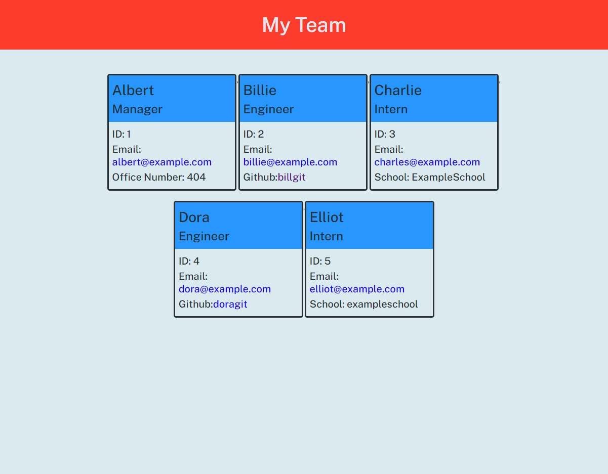

# Team profile generator

This generates a HTML profile for your team based on inputs.  It lets you enter the name, ID, email for your team members and has 3 different types of employees: manager, engineers and intern.  The manager will also allow for an office number input.  The engineers will have a link to their github and the interns will have their school.

Video tutorial: https://watch.screencastify.com/v/sqesOvlT3ppMWMw3SmaP
